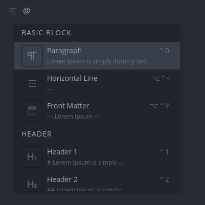
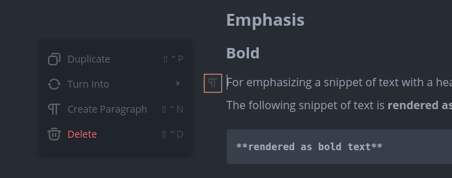
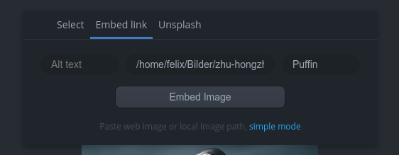
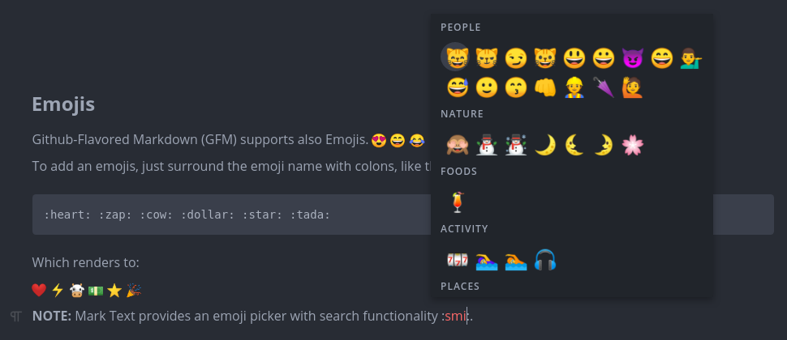
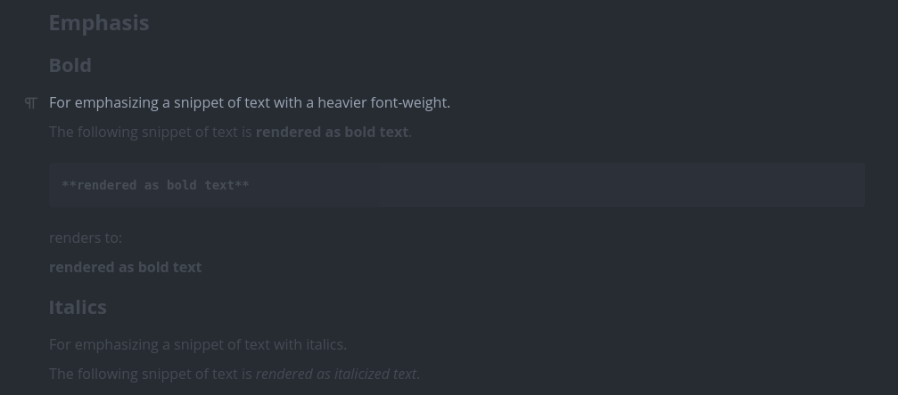

# Editing in Depth

Let us take a look at the realtime editor and editing features.

## Text manipulation

Mark Text shows you formatted text in realtime while you can simply write and edit text but also use markdown syntax. To improve your writing efficiency there are a lot of key bindings for better text manipulation. In the preferences you can control the editor settings such as font settings, autocompletion and line width.

## Selections

You can select text with your mouse cursor, double click on a word or use the keyboard <kbd>Shift</kbd>+<kbd>Arrow Keys</kbd>.

**Format overlay:**

The format overlay is a pop up that automatically appears when you're selecting text. You can easily transform text and inline markdown but also remove formatting.

- Bold
- Italics
- Underline
- Strikethrough
- Inline code
- Inline math formulas
- Create link
- Create image
- Remove formatting

Further overlays are available for emojis, links, images and tables.

## Deleting

Do you want to delete headings, lists or tables? Just select the area and press backspace.

## Brackets and quotes autocompletion

You can configure Mark Text to autocomplete markdown syntax, brackets and quotes. By default `()`, `[]`, `{}`, `**`, `__`, `$$`, `""` and `''` are completed when the first character is typed.

## Links

Links are shown by default as normal text but if you click on a link the link is shown as markdown link with title and URL like below:

## Formatting

Mark Text will automatically format your markdown document according CommonMark and GitHub Flavored Markdown specification. You can control few settings via preferences such as list indentation.

## Editing features

#### Quick insert

When you start a new line, just type `@` to show a pop up with all available markdown features. Now you can select an entry and the line is transformed into the selected one.

#### Line transformer

You can transform a line into another type by clicking on the highlighted icon in the image below and select `Turn Into`. Furthermore, you can duplicate the selected line, create a paragraph above the selected line or delete the line.

#### Table tools

It's sometimes hard to write and manage tables in markdown. In Mark Text you can press <kbd>CmdOrCtrl</kbd>+<kbd>Shift</kbd>+<kbd>T</kbd> to get a table dialog and create a table with variable row and column count. Both row and column count can be changed via the table tools (first icon above the table) later if necessary. You can use all inline styles in a table cell and align the text via table tools at the top of the table.

**Insert and delete rows and columns:**

You can insert or delete a new row or column by clicking on an existing cell and click on the menu on the right side for rows or bottom for columns.

**Move table cells:**

You can simply move a row or column by clicking on the cell menu (like above) and dragging it by holding your mouse left-button like this:

#### Image tools

Mark Text provides an image viewer and a pop up to select and label images. You can resize any image by your mouse cursor and changes are applied in realtime. By clicking on an image or writing `` a pop up is automatically shown that allows you to select an image from disk or paste a path or URL. Images can be automatically uploaded to cloud, moved to a relative or absolute path on disk. Even pasting images that are not located on disk is supported and these images are stored in the background. In addition, you can control the image alignment whether inline, left, centered or right.

#### Emoji picker

Instantly add emojis to your markdown document without long searches. During typing, we automatically refresh the list of available emojis.

#### Focus mode

The focus mode will help you to focus on the currently line only by fading out other lines. To activate the focus mode, simply press <kbd>CmdOrCtrl</kbd>+<kbd>Shift</kbd>+<kbd>F</kbd>.

#### Typewriter mode

In typewriter mode, the cursor is always keep in the middle of the editor.

## File encoding

Mark Text try to automatically detect the used file encoding and byte-order mark (BOM) when opening a file. The default encoding is UTF-8 that should support all needed characters but can be changed in settings. You can disable automatically encoding detection but then we assume that all files are UTF-8 encoded. The current used encoding can be shown via command palette and also changed there.

## Line endings

Mark Text automatically analyzes each file and detect the used line ending and can be changed via command palette too.

## Find and replace

**Inside the editor:**

To quickly find a keyword in your document press <kbd>CmdOrCtrl</kbd>+<kbd>F</kbd> to open the search pop up. Now you can search for text or replace the given keyword.

**Search in opened folder:**

Mark Text provides a build-in filesystem explorer (tree view) with a fast file searcher. Type a keyword in the search bar and select the needed options like regex or case-insensitive search. That's all, now Mark Text will search all markdown files in the opened root directory.
